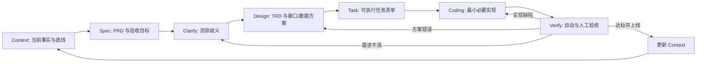
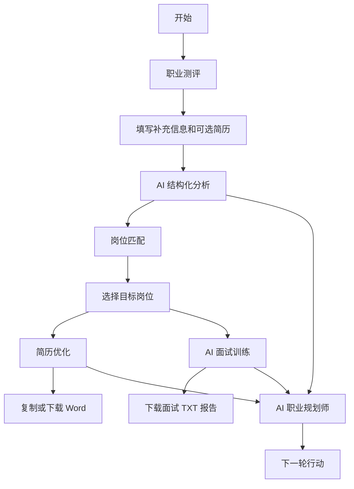
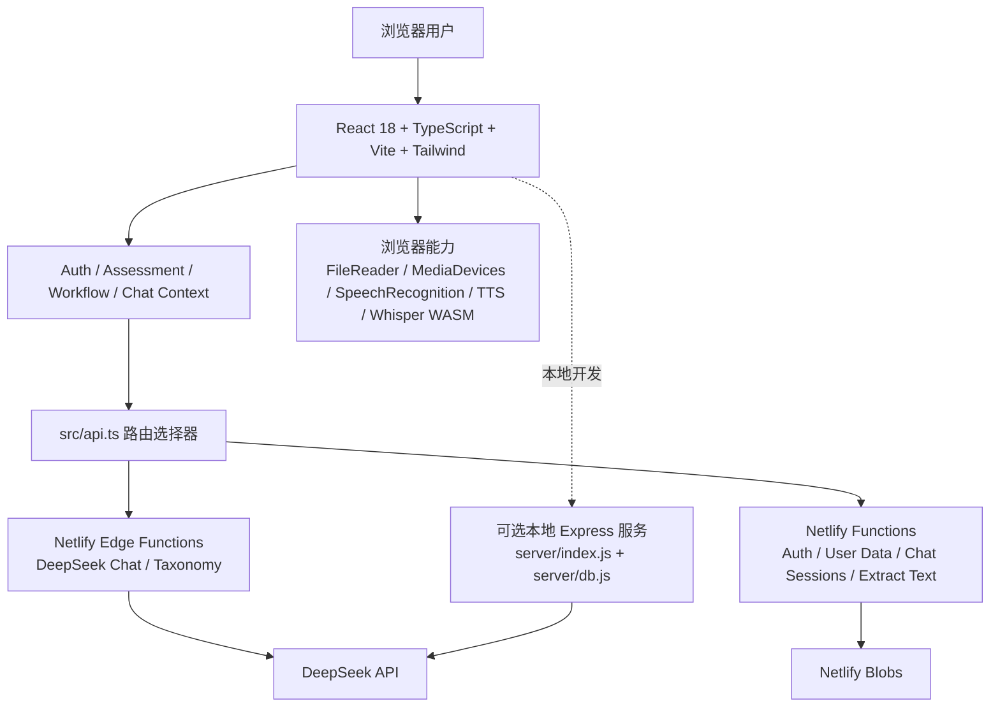

# 职向未来 Pro - 项目 Context

> **用途**：这是“职向未来 Pro”唯一的长期维护上下文基线。后续所有 `Spec`、`Clarify`、`Design`、`Task`、`Coding`、`Verify` 必须先阅读并遵守本文件。任何与本文件冲突的需求，必须先走 Clarify；任何上线功能必须回写本文件。
>
> **基线日期**：2026-07-28
> **已验证生产提交**：`d3d167a`（2026-07-28）
> **生产站点**：https://career-future.netlify.app/
> **仓库**：`git@github.com:czh272849818-wq/Career-Future.git`，默认分支 `main`

## 1. 文档契约

### 1.1 信息来源与可信度

本文件基于以下证据整理，而非基于界面文案或假设：

1. 项目全部受版本管理的源码、配置、函数与静态模板。
2. `智能纪要：AI驱动项目开发流程讲解 2026年7月28日 (1).pdf`。
3. `智能纪要：AI驱动项目开发流程讲解 2026年7月28日 (3) (1).pdf`。
4. 2026-07-28 的本地构建与线上 Netlify 部署状态。

状态标记必须按以下定义使用：

| 标记 | 定义 |
| --- | --- |
| `已实现` | 代码、可达入口和真实执行链路均存在。 |
| `部分实现` | 主链路存在，但有明确边界、降级、未接通或安全缺口。 |
| `未实现` | 没有可供用户使用的完整链路，或仅有未接入代码。 |
| `禁止假定` | 未经代码、配置或生产验证，不得把能力描述成已上线。 |

### 1.2 SDD 闭环

会议纪要确定的工作方式是规范驱动开发，而不是无边界的“看到问题就改”。标准闭环如下：



**准出原则**：每个需求必须有可验证的验收项。目标是相关测试用例通过率不低于 95%；在测试体系尚未建立前，不得以“页面能打开”代替验收。

### 1.3 Context 更新规则

以下变化必须在同一版本更新 Context：

- 新增、删除或改变用户流程、路由、接口、数据结构、权限、第三方服务或环境变量。
- 已实现能力变为部分实现，或部分实现变为已实现。
- 任何安全、隐私、成本、性能或可用性风险的状态变化。
- 任何产品原则、视觉规范、验收标准或模块所有权变化。

不应为了追求“文档完整”而写入未经验证的规划。规划只可进入“待建设”区，不能进入“当前能力”。

## 2. 第一性原理与产品边界

### 2.1 本质判断

职向未来 Pro 的本质不是职业内容生成器，而是帮助求职者把“不了解自己、没有目标岗位、简历不匹配、面试无法表达”压缩成一条可执行且可复用的求职决策闭环。

### 2.2 目标用户与核心任务

| 用户 | 核心任务（Job To Be Done） | 成功结果 |
| --- | --- | --- |
| 在校学生、应届生、转行者 | 找到值得投入的职业方向和岗位 | 有明确的行业、岗位和下一步行动。 |
| 有简历但投递低效的求职者 | 将原始经历改写为目标岗位能理解的证据 | 产出可复制、可下载、可投递的简历版本。 |
| 已有目标岗位的求职者 | 在真实岗位上下文中训练回答与追问 | 完成一轮可回看的模拟面试并知道改进重点。 |
| 需要长期职业决策支持的用户 | 获得连续、可追溯的职业规划对话 | 历史对话和阶段产物能跨设备恢复。 |

### 2.3 北极星工作流

```text
职业画像 -> 岗位池 -> 锁定目标岗位 -> 岗位化简历 -> 针对性面试 -> 复盘与下一轮投递
```

该链路优先于单一页面的功能数量。任何新增功能必须回答：它是否减少用户在这条链路中的不确定性、重复劳动或转化损失？如果不能，默认不做。

### 2.4 非目标

- 不把“模拟分数”包装成权威心理测量或真实招聘结论。
- 不承诺自动投递、保证 offer、替代真人职业顾问或法律/医疗建议。
- 不在没有用户授权、数据生命周期和访问控制前扩张为管理员 CRM/SCRM。
- 不因视觉装饰、重复入口或未接通的第三方登录而增加复杂度。

## 3. 当前产品全景

### 3.1 已发布模块状态

| 模块 | 状态 | 当前真实能力 | 关键限制 |
| --- | --- | --- | --- |
| 首页 `/` | 已实现 | 进入测评或控制台的最小入口。 | 当前仍使用较强的渐变与装饰背景，不是严格的极简视觉。 |
| 邮箱注册与登录 | 部分实现 | 邮箱+密码注册、邮箱+密码登录、浏览器本地会话恢复。 | 登录与注册仍是两个路由；无邮箱验证码、找回密码、限流、会话过期或完整鉴权。 |
| 职业测评 `/assessment` | 部分实现 | 通用/行业岗位测评、DeepSeek 动态题库、8 题缓存、本地题库回退、简历文本辅助分析、结构化结果。 | 不是经过心理测量验证的正式量表；结果可被启发式和 AI 覆盖；历史数据权限保护不足。 |
| 岗位匹配 `/jobs` | 部分实现 | 行业、岗位选择；可上传简历提取文本；调用 AI 生成/分析岗位推荐并把岗位写入工作流。 | 岗位不是实时招聘市场数据；没有职位爬取、投递、收藏或职位真实性校验。 |
| 简历优化 `/resume` | 部分实现 | PDF/DOCX 文本提取、粘贴文本、JD 对比、关键词与证据分、AI JSON 草稿、本地降级草稿、可复制正文、中文/英文模板 Word 下载、最近 10 条简历记录。 | 原文件二进制未上云；分数是启发式；模板替换不能保证复杂版式的语义正确性；上传仅支持 PDF/DOCX 入口。 |
| AI 面试 `/interview` | 部分实现 | 行业/岗位/职责上下文、四类面试、AI 题目生成与本地题库回退、主问题+追问、文字回答、浏览器语音输入、摄像头预览、浏览器 TTS、TXT 报告下载。 | “数字人”是 CSS 状态层，不是视频数字人；评分以回答完成度/长度为主，不是语义评估；面试结果未持久化。 |
| AI 职业规划师 `/ai-chat` | 部分实现 | 多会话、流式 DeepSeek 回复、Markdown/表格渲染、附件文本提取、Web Speech/Whisper 浏览器转写、本地与云端会话恢复。 | 附件内容不进入云端会话；大模型转写下载重；用户会话接口缺少鉴权；非文本附件能力有边界。 |
| 控制台 `/dashboard` | 部分实现 | 根据工作流状态给出下一步、显示测评/岗位/简历/规划阶段。 | 部分完成条件来自内存或弱持久化；不是运营后台。 |
| 管理员后台 / SCRM | 未实现 | 无管理员路由、角色、用户检索、运营指标、审计日志或权限系统。 | 必须作为独立需求完成完整 SDD 后才可开发。 |
| 邮箱验证码、微信、手机号登录 | 未实现为用户能力 | 后端存在手机号/微信函数草案。 | 当前 UI 只提供邮箱登录；Netlify API 路由也未映射手机号/微信入口；不可对用户宣称可用。 |

### 3.2 当前页面与导航

| 路由 | 页面责任 | 主要上下文 |
| --- | --- | --- |
| `/` | 产品入口 | 无 |
| `/assessment` | 职业画像与分析报告 | `AssessmentContext`、`WorkflowContext` |
| `/jobs` | 目标行业/岗位选择与推荐 | `AssessmentContext`、`WorkflowContext` |
| `/resume` | 岗位化简历草稿与导出 | `WorkflowContext`、`AuthContext` |
| `/interview` | 面试上下文、训练、报告 | `AssessmentContext`、`WorkflowContext` |
| `/ai-chat` | 职业规划师会话 | `ChatContext` |
| `/career-planning` | 基于工作流的职业计划页 | `WorkflowContext` |
| `/dashboard` | 进度、下一步与阶段入口 | 所有主要 Context |
| `/login`、`/register` | 邮箱认证入口 | `AuthContext` |

当前 `App.tsx` 没有路由守卫。未登录用户可访问大部分功能页面，但只有登录后的部分状态会尝试写入云端。后续需求不得误认为所有页面已受认证保护。

### 3.3 核心用户路径



“岗位选择”是简历优化和岗位面试质量的共同前置条件。任何跳过该前置条件的页面必须提供清晰降级提示，而不是伪造岗位化结果。

## 4. 技术架构

### 4.1 分层架构



### 4.2 源码树与所有权

```text
职向未来Pro/
├── src/
│   ├── App.tsx                         # Provider 组合与全部前端路由
│   ├── api.ts                          # 本地/Netlify API 路由分发
│   ├── llm/config.ts                   # 模型、温度、流式开关默认值
│   ├── contexts/
│   │   ├── AuthContext.tsx             # 本地会话状态与邮箱认证调用
│   │   ├── AssessmentContext.tsx       # 题库、答题、测评结果和历史
│   │   ├── WorkflowContext.tsx         # 跨模块职业工作流状态
│   │   └── ChatContext.tsx             # 会话、流式消息、本地/云端同步
│   ├── pages/
│   │   ├── Assessment.tsx              # 职业测评与结构化分析报告
│   │   ├── JobMatching.tsx             # 岗位匹配
│   │   ├── ResumeEnhancement.tsx       # 简历分析、草稿、Word 导出
│   │   ├── InterviewSimulation.tsx     # 面试训练
│   │   ├── AIChat.tsx                  # 职业规划师 UI
│   │   ├── CareerPlanning.tsx           # 职业计划
│   │   ├── Dashboard.tsx               # 控制台
│   │   ├── Homepage.tsx                # 首页
│   │   ├── Login.tsx / Register.tsx    # 邮箱认证 UI
│   └── components/                     # 导航、聊天、图表、工作流等复用 UI
├── netlify/
│   ├── edge-functions/                 # DeepSeek 流式代理与 taxonomy
│   └── functions/                      # 身份、数据、聊天、文件文本提取
├── server/                             # 本地 Express 替代后端，不是生产主路径
├── public/resume-templates/            # 中文/英文 Word 模板
├── netlify.toml                        # Netlify 构建、函数和重定向
└── package.json                        # 命令和依赖
```

### 4.3 运行时与部署事实

| 层 | 当前实现 | 生产事实 |
| --- | --- | --- |
| 前端 | React 18、TypeScript、Vite 6、Tailwind 3、React Router 7 | Netlify 从 `main` 构建 `dist`。 |
| AI 代理 | DeepSeek Edge Function 为生产优先路径 | 需要 Netlify 环境变量 `DEEPSEEK_API_KEY`。 |
| 文件提取 | Netlify Function；本地 Express 有对应实现 | 支持多格式文本提取，但不同格式的语义能力不同。 |
| 云端状态 | `@netlify/blobs` | 认证/工作流数据与聊天会话分别存储。 |
| 本地开发 | Vite 代理 `/api` 到 `http://localhost:3001` | 需要另开 Express 服务才能使本地 API 完整可用。 |
| 生产部署 | Netlify Git 集成已实际生效 | `d3d167a` 已上线并经生产 Function 验收。README 所述 GitHub Actions 工作流在当前仓库不存在。 |

## 5. 数据、接口与 AI 链路

### 5.1 前端状态归属

| 状态域 | 所有者 | 当前持久化位置 | 重要说明 |
| --- | --- | --- | --- |
| 登录会话 | `AuthContext` | 浏览器 `localStorage` | `auth_token` 与 `user_data` 不等于服务端会话验证。 |
| 测评题库缓存 | `AssessmentContext` | 浏览器 `localStorage`，6 小时 | 仅缓存 AI 生成题目。 |
| 测评结果 | `AssessmentContext` | 内存；登录后尝试写 `user-assessments` | 生产请求附带 Bearer token，服务端从令牌推导用户 ID。 |
| 跨页面工作流 | `WorkflowContext` | 内存；登录后写 `user-data` | 含画像、选中岗位、优化结果、职业计划；生产请求附带 Bearer token。 |
| 聊天会话 | `ChatContext` | 本地优先；登录后 Netlify Blobs | 云端只保存附件元数据，不保存 `dataUrl` 或原文。 |
| 简历历史 | `ResumeEnhancement` | `user-data.resumes` | 仅保存结构化草稿、摘要和文件名，不保存原始文件；生产请求附带 Bearer token。 |
| 面试过程与报告 | `InterviewSimulation` | 仅内存/下载文件 | 刷新后丢失，当前不属于云端历史能力。 |

### 5.2 Netlify API 契约

| 逻辑 API | 生产实际端点 | 方法 | 当前责任 |
| --- | --- | --- | --- |
| `/api/deepseek/chat` | `/deepseek-chat` | `POST` | DeepSeek 代理，支持非流式和 SSE 流式输出。 |
| `/api/deepseek/taxonomy` | `/deepseek-taxonomy` | `GET` | 行业/岗位 taxonomy。 |
| `/api/extract-text` | `/.netlify/functions/extract-text` | `POST` | Base64 文件文本提取。 |
| `/api/auth/register` | `/.netlify/functions/auth-register` | `POST` | 邮箱密码注册。 |
| `/api/auth/login` | `/.netlify/functions/auth-login` | `POST` | 邮箱或手机号标识符+密码登录；当前 UI 只传邮箱。 |
| `/api/users/:id/data` | `/.netlify/functions/user-data?userId=:id` | `GET/POST/PUT` | 工作流、简历历史等通用用户数据。 |
| `/api/users/:id/assessments` | `/.netlify/functions/user-assessments?userId=:id` | `POST` | 新增测评历史。 |
| `/api/chat-sessions` | `/.netlify/functions/chat-sessions` | `GET/POST/PUT` | 读写用户聊天会话。 |

`apiUrl()` 在生产 Netlify 域名上优先选择上述 Functions/Edge Functions；开发环境保留 `/api/*` 并由 Vite 代理转发。本地 Express 是替代路径，不应与生产 Functions 的行为默认等同。

### 5.3 文件和多模态能力边界

| 类型 | 入口/提取 | 当前能力 | 不应承诺 |
| --- | --- | --- | --- |
| PDF | 测评、岗位、简历、聊天 | 文本层提取；测评端可做客户端 OCR 降级。 | 扫描 PDF 的稳定高精度识别。 |
| DOCX / DOC | 文件提取 Function | Raw text 提取。 | 原版式保真编辑。 |
| XLS/XLSX/CSV | 聊天附件/提取 Function | 首个工作表或文本转换为上下文。 | 多表建模、复杂公式理解。 |
| 图片 | 提取 Function | OCR。 | 视觉推理、表格/证件的生产级识别。 |
| MP4 | 提取 Function | 仅文件名和大小元信息。 | 视频内容、音轨转写或视频理解。 |
| 音频/语音 | 浏览器 `SpeechRecognition`，失败时 MediaRecorder + Whisper WASM | 语音转文本；需要用户授权设备。 | 跨浏览器稳定性、服务端录音存档。 |

### 5.4 AI 结果规则

- DeepSeek 只经后端/边缘代理调用；浏览器不得拥有 API 密钥。
- AI 结构化输出必须经过 JSON 解析、长度截断、字段校验与本地降级，不得直接作为可信数据写入。
- 角色设定、用户输入、文件文本、岗位 JD 都是不可信内容；不得让其中的指令改变系统权限、泄露密钥或绕过产品规则。
- 简历、测评、岗位和面试输出必须明确为“辅助建议”，不可暗示其等同于真实招聘结论或专业资格测评。

## 6. 模块工作流与关键事实

### 6.1 职业测评

1. 用户选择通用或行业岗位测评。
2. `AssessmentContext` 优先读取 6 小时本地 AI 题库缓存；无缓存时调用 DeepSeek，失败则回落内置题库。
3. 用户逐题作答，结果由选项 trait 和基础规则计算。
4. 用户可上传简历，并填写价值观、性格、专业；页面请求 AI 生成分析和紧凑 JSON 结构。
5. 完成时写入 `WorkflowContext`；若登录，额外尝试写入测评记录。

**产品事实**：页面中存在行业与岗位选择、简历文本提取、结构化分析展示。其“分数/标签/推荐”不是临床或职业资格测验结果。

### 6.2 岗位匹配

1. 拉取行业和岗位 taxonomy。
2. 接受简历文本与筛选条件。
3. 将简历、用户画像、行业/岗位条件交给 DeepSeek 生成岗位推荐。
4. 用户选择一个 `selectedJob`，写入 `WorkflowContext`。
5. 后续简历和面试默认继承这个岗位上下文。

**产品事实**：推荐岗位是 AI 生成或产品内数据，并非招聘网站实时职位池。岗位的公司、薪资、地点等字段不能被解释为已经验证的外部招聘信息。

### 6.3 简历优化

1. 使用已上传简历、测评中简历文本、当前页面上传或直接粘贴文本。
2. 读取选中岗位/JD，抽取关键词并计算启发式关键词、证据、聚焦分。
3. 请求 DeepSeek 产出 JSON 简历草稿；失败时生成结构化本地降级草稿。
4. 显示修改前后、优化结果和固定高度可滚动的可复制正文。
5. 按中文或英文模板替换 Word XML，失败时使用内置 DOCX 生成器，下载 `.docx`。
6. 登录用户保存最多 10 条草稿历史到 `user-data.resumes`。

**不得误解**：下载能力是“生成新的 Word 成品”，不是逐字修订用户原始 Word 文件；原附件不会上传到对象存储或永久保存。

### 6.4 AI 面试

1. 选择行业、岗位、岗位介绍和职责/技能/加分项。
2. 选择面试类型：综合、基本素养、行业知识、岗位需求；综合面试可配置多轮。
3. 优先调用 DeepSeek 生成开场、行为、深挖、反问四类问题；失败时使用本地题库。
4. 用户输入文本或用浏览器录音转写回答；每个主问题后进入规则生成的追问。
5. 结果按答题覆盖率、回答长度等规则生成阶段分和建议，并导出 TXT。

**不得误解**：

- 摄像头只是本地 `<video>` 预览，不上传视频，不做视频分析。
- 浏览器 TTS 可朗读问题；“AI 数字人面试官”是视觉状态层，不是真实数字人驱动服务。
- 当前评分不是 LLM 对答案内容的逐题语义打分，不能宣传为真实面试能力评估。
- 设备权限由浏览器和用户控制。拒绝权限时文字作答必须仍然可用。

### 6.5 AI 职业规划师

1. `ChatContext` 初始化或恢复一个会话。
2. 用户发送文本与附件；附件先通过文本提取接口变为上下文。
3. 请求 DeepSeek；默认允许 SSE 流式输出并逐段更新 AI 消息。
4. AI 输出经 Markdown/GFM 渲染，支持标题、列表、代码和表格。
5. 登录用户把去除附件原文后的会话写入 Netlify Blobs；游客保留在浏览器本地。

**交互准则**：Enter 发送、Shift+Enter 换行，必须兼容中文输入法 composition；消息区独立滚动，输入区不得被长内容挤出视野。

## 7. 设计与工程底线

### 7.1 产品设计原则

1. **单一主线**：任何页面都必须帮助用户进入或完成“画像 -> 岗位 -> 简历 -> 面试 -> 复盘”的下一步。
2. **先决策，后生成**：先要求用户提供足以决定方向的岗位上下文，再生成简历或面试内容。
3. **真实反馈**：系统只能显示已发生的状态。权限被拒绝、解析失败、AI 降级、云端保存失败必须被准确表达。
4. **低认知负担**：一次只要求用户完成一个关键动作；长输出必须分段、可扫描、可折叠或在内部滚动。
5. **连续性优先**：同一用户跨模块可复用画像、目标岗位和简历草稿；不要要求重复输入已经拥有的信息。
6. **最小充分功能**：没有可验证结果的入口、按钮、状态或“即将上线”不应存在于用户界面。

### 7.2 视觉原则

当前实现以深灰背景、紫蓝渐变和绿色主操作为主。后续改动要统一为以下约束：

- 保持信息密度高、层级清楚、文本可扫描；面向工具而不是营销页。
- 使用现有 Tailwind 和 Lucide 图标；按钮使用图标或图标+清晰命令，避免文字胶囊泛滥。
- 固定格式容器必须有稳定高度和明确滚动归属。聊天消息、简历正文、报告等长内容不能无限撑高页面。
- 不增加装饰性发光球、无意义渐变、嵌套卡片或重复页头。
- 移动端和桌面端都必须避免按钮截断、文字重叠、横向溢出和跳动布局。
- 新页面不得自行发明另一套配色、圆角、间距或交互模式。

### 7.3 工程原则

1. 只修改完成需求所必需的模块；不以顺手重构替代明确设计。
2. 先复用 `apiUrl()`、现有 Context、Netlify Function 和现有模板，再考虑新抽象。
3. 任何用户数据读写都必须由服务端根据经过验证的身份推导用户 ID；前端传入的 `userId` 永远不可信。生产已实现此规则；Netlify 控制台仍必须确认 `AUTH_SECRET` 为仅生产作用域的随机密钥。
4. 密钥只能位于 Netlify/服务端环境变量；不得进入源代码、浏览器环境变量、日志、文档或提交记录。
5. AI 输出、文件文本、URL 参数、浏览器存储均是外部输入，必须限制大小、校验结构、处理失败。
6. 所有高风险用户操作都必须有恢复路径：下载失败可重试、解析失败可改粘贴文本、设备失败可改文字回答。
7. 文档与实现同等重要。上线完成且 Context 未同步更新，视为未完成。

## 8. 当前风险与技术债务

### P0：上线扩张前必须治理

| 风险 | 代码事实 | 影响 | 完成标准 |
| --- | --- | --- | --- |
| 用户数据越权 | 生产 `d3d167a` 已验证 Bearer token 的 HMAC 签名、7 天过期及身份归属；服务端忽略客户端写入的 `userId`。 | 未经授权的直接访问已被阻断；`AUTH_SECRET` 未经控制台核验前，签名密钥管理仍是 P0。 | 匿名返回 `401`、用户 A 访问用户 B 返回 `403` 已生产验证；在 Netlify 确认配置仅限生产的 `AUTH_SECRET` 后关闭此项。 |
| 认证安全不足 | 密码仍使用单轮 SHA-256+salt；token 已有服务端签名验证与 7 天过期控制；`AUTH_SECRET` 仍保留本地 `dev-secret` 回退，且本轮无法读取 Netlify 变量确认生产密钥。 | 账户安全尚不满足开放产品要求。 | 在 Netlify 设置仅限生产作用域的随机 `AUTH_SECRET`，再迁移至成熟身份服务或强密码哈希、短期会话/刷新机制、速率限制和审计。 |
| AI/文件隐私边界不完整 | 用户简历和附件文本会送入 DeepSeek；无同意、保留期、删除策略或数据说明。 | 个人数据合规和信任风险。 | 增加明确授权、最小化发送、隐私政策、删除入口和数据保留策略。 |
| 单 Blob 全量状态 | 认证状态保存为单个 `career-future-auth-state/state` JSON，再读取-修改-覆盖。 | 并发写丢失、容量和性能不可扩展。 | 迁移到逐用户键或关系型数据库，并有并发/迁移方案。 |

**2026-07-28 生产验收**：`user-data`、`user-assessments` 和 `chat-sessions` 已验证 Bearer token、令牌签名、7 天有效期及用户归属；匿名请求返回 `401`，演示账户读取自身数据返回 `200`，同一令牌读取其他用户返回 `403`。本轮没有 Netlify 管理员会话，无法读取或写入环境变量，因此 `AUTH_SECRET` 的生产配置必须在控制台完成并复验。

### P1：核心体验与可靠性

| 风险 | 当前事实 | 优先策略 |
| --- | --- | --- |
| 面试评分解释不准确 | 分数主要由回答覆盖与文本长度得出。 | 引入逐题结构化 AI 评分、证据引用、用户可见评分依据，并保留失败降级。 |
| 数字人预期错配 | 仅 CSS 状态和 TTS。 | 在未接入真正数字人前改为“AI 面试官”；若要接入，先完成实时音视频、成本、隐私和失败方案的 TRD。 |
| 文件能力表述过宽 | MP4 仅元信息；不同格式提取质量差异大。 | UI 按实际能力拆分，增加格式/大小限制与明确失败反馈。 |
| 简历上传与导出边界 | 原文件不持久化；模板替换只适合固定模板。 | 明确“生成新版本”；需要原件编辑时设计对象存储、版本、权限和可追溯差异。 |
| 工作流数据一致性 | `recommendedJobs` 不写云端；`File` 不能可靠 JSON 化；面试结果不保存。 | 定义正式数据模型与所有跨模块状态的持久化策略。 |
| 打包体积 | 当前主包约 1.15 MB，Whisper/Transformers chunk 约 825 KB。 | 对 Whisper、PDF/OCR 等重依赖延迟加载并定义性能预算。 |

### P2：质量体系与可维护性

| 风险 | 当前事实 | 优先策略 |
| --- | --- | --- |
| 测试缺失 | 仓库没有单元、集成或端到端测试文件。 | 先覆盖认证、数据权限、核心工作流、文件提取与导出。 |
| 静态检查不可用 | `npm run lint` 当前因 ESLint 9 与 TypeScript 插件规则兼容性错误而无法执行。 | 固定兼容版本并将 lint 纳入准出。 |
| 文档漂移 | README 声明存在 `.github/workflows/netlify-deploy.yml`，仓库实际不存在。 | 将部署文档改为可验证事实，或补齐工作流和密钥配置。 |
| UI 组件一致性 | 页面以 Tailwind 内联样式为主，存在重复卡片、渐变和返回按钮模式。 | 先建立少量页面级与工具级模式，再做定向迁移，禁止全局美化式重构。 |
| 无运营后台 | 管理员、角色、指标、用户搜索、审计均不存在。 | 作为独立产品面与权限体系需求，不与用户侧小改动混做。 |

**2026-07-28 质量状态**：已新增 `tests/auth-token.test.mjs`，覆盖缺失、篡改、过期 token 与跨用户 Functions 访问；ESLint 已从运行时兼容性错误恢复为可执行检查，但当前仍报告 79 个错误和 11 个警告。不要通过关闭规则获得假通过。

## 9. 质量门禁与验证矩阵

### 9.1 已验证的当前基线

| 检查 | 状态 | 证据/说明 |
| --- | --- | --- |
| `npm run build` | 通过 | Vite 可构建生产产物。 |
| 线上 Netlify 部署 | 通过 | `d3d167a` 的生产 Functions 已响应新鉴权行为。 |
| `npm run lint` | 未通过 | 工具链已可运行；当前报告 79 个错误、11 个警告，属于需单独治理的历史基线。 |
| 自动化测试 | 部分通过 | `npm test` 已覆盖 token 签名、过期、篡改和 Functions 越权拒绝；远未达到 95% 测试准出。 |
| 生产安全验收 | 部分通过 | 认证与越权路径通过生产验收；生产 `AUTH_SECRET` 配置和密码哈希仍未关闭。 |

本次验证：`npm test` 4/4 通过，`npm run build` 通过；`npm run lint` 可运行但未通过；生产 `/.netlify/functions/user-data` 匿名访问为 `401`，演示用户本人成为 `200`，跨用户为 `403`。

构建告警也必须被记录：`pdfjs-dist` 与 `onnxruntime-web` 使用 `eval`；主包超过 500 KB。这些不是构建失败，但在 CSP、安全与性能设计中必须被评估。

### 9.2 每次需求的最低 Verify 清单

| 变更类型 | 最低自动检查 | 最低人工验收 |
| --- | --- | --- |
| 纯 UI/布局 | build、相关组件测试（建立后） | 桌面+移动端截图；无溢出/重叠；键盘与焦点可用。 |
| 业务工作流 | build、状态/路由测试 | 从入口走到结果，刷新、返回、失败重试均正确。 |
| AI 输出 | JSON schema/降级测试 | 正常、超长、非 JSON、超时、敏感附件各一次。 |
| 文件处理 | 格式/大小/错误测试 | PDF、DOCX、图片、XLSX、MP4 各验证其声明的真实边界。 |
| 认证/数据 | 鉴权、越权、会话过期测试 | 两个用户交叉访问和删除场景均不可泄露。 |
| 部署 | build、环境变量存在性检查 | Netlify 生产 API、SPA 深链、关键页面实际可用。 |

### 9.3 建议的首批测试资产

1. 认证 token 验证和“用户 A 不能读写用户 B 数据”的 Functions 集成测试。
2. `apiUrl()` 在本地、预览、生产域名下的端点路由测试。
3. 测评 -> 选择岗位 -> 简历草稿 -> Word 下载的最短端到端路径。
4. 聊天流式响应、流中断、附件剥离、游客登录迁移测试。
5. 简历/附件格式解析及失败降级测试。
6. 面试主问、追问、文字模式、无设备权限模式和报告下载测试。

## 10. 后续 SDD 工作模板

### 10.1 Spec（PRD）必须回答

```text
问题：用户当前在哪一步失败、耗时或不信任？
目标：成功后用户能完成什么可观察动作？
范围：包含什么，不包含什么？
前置条件：用户、数据、权限、第三方服务分别需要什么？
用户路径：起点 -> 主动作 -> 成功/失败结果。
验收：可量化的行为、文案、数据和边界条件。
指标：激活、完成率、转化、留存、成本或人工节省中的哪一项发生改善？
```

### 10.2 Clarify 必须消除的歧义

- “优化”“更好看”“放大”“可用”“实时”“智能”“完整”不是可开发要求，必须转成尺寸、状态、权限、输入、输出、失败行为和验收指标。
- 明确谁可以做什么、用什么数据、数据保存多久、失败时如何恢复。
- 明确是“展示”“生成”“编辑原文件”“分析内容”还是“仅保存元信息”。
- 明确第三方能力是否已开通；未开通的微信、短信、数字人、视频理解不能出现在已上线范围。

### 10.3 Design（TRD）最小结构

```text
1. 目标和不做什么
2. 影响的路由、页面、组件、Context、Function、Blob/数据库键
3. 数据模型、迁移与删除策略
4. API 契约：鉴权、请求、响应、错误码、幂等性、大小限制
5. 正常/异常/降级流程图
6. 安全、隐私、成本、性能影响
7. 任务拆分与测试用例
8. 上线、回滚、Context 更新方案
```

### 10.4 Coding 约束

- 从已批准 TRD 的任务开始，不在实现阶段补充未讨论的功能。
- 不在前端复制认证/授权逻辑；权限必须在后端执行。
- 不新增未使用的“灵活性”、抽象层或 UI 入口。
- 每一处 AI 调用必须有超时、非 JSON、空输出、限流或服务不可用的用户可理解降级。
- 文件内容和 AI 输出必须限制大小，不得把二进制或大附件直接写入会话/Blob JSON。

### 10.5 Verify 与回流规则

| 失败类型 | 回到阶段 |
| --- | --- |
| 用户问题、范围或验收不清 | Clarify |
| 数据、接口、权限、成本或技术路线不成立 | Design |
| 实现与 TRD 不一致或存在缺陷 | Coding |
| 页面可用但未满足用户目标/指标 | Spec |

## 11. 下一阶段的架构优先级

这是优先级，不是已获批准的开发任务。每项仍需单独完成 Spec、Clarify 和 Design。

1. **先建立安全可用的数据底座**：身份验证、服务端授权、用户隔离、密码策略、数据删除、隐私说明、可观察性。
2. **再使核心闭环持久化**：职业画像、岗位池/选择、简历版本、面试报告必须拥有正式的数据模型和版本策略。
3. **再提升结果可信度**：把面试评分和岗位推荐从“完成度/文案生成”升级为有证据、有解释、有降级的结构化评估。
4. **最后扩展管理与增长系统**：管理员后台、运营指标、用户分层、触达和内容飞轮必须建立在安全数据模型之上。

最高杠杆点不是再增加一个 AI 页面，而是把用户的关键状态安全、连续、可解释地贯穿现有四步主线。

## 12. 术语表

| 术语 | 本项目定义 |
| --- | --- |
| 职业画像 | 测评答案、补充信息、AI 分析、分数、标签和建议的组合。 |
| 目标岗位 | `WorkflowContext.selectedJob`，是简历优化和面试训练的关键上下文。 |
| 工作流状态 | 在 `WorkflowContext` 中跨页面共享的测评、岗位、简历和职业计划状态。 |
| 简历草稿 | AI 或本地降级生成的结构化 `ResumeDraft`，不是用户原始文件。 |
| 数字人面试官 | 当前只指 UI 状态层和浏览器朗读效果，不指真实视频数字人。 |
| 云端存储 | 当前主要指 Netlify Blobs；不等同于完成用户隔离、备份、合规或管理员系统。 |
| 准出 | 一个需求在 Verify 中达到其预定义验收条件后，才允许上线。 |

---

**维护提醒**：本文件描述“现在实际是什么”，并规定“后续应如何改变”。若实现与本文件不一致，应优先修正文档事实或回退不符合规范的实现，而不是让两者长期漂移。
